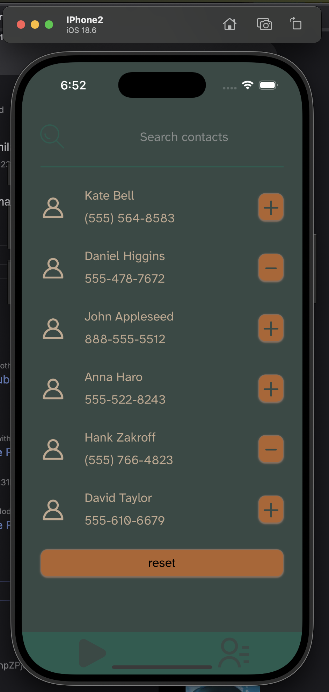
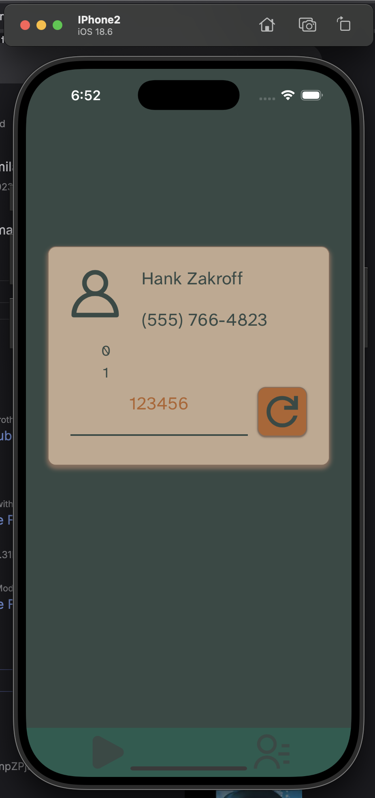

# Creating Mobile app using Tauri + Svelte

The goal of Project [Two](https://github.com/minosiants/two) is to get familiar with [Tauri](https://v2.tauri.app/), a Rust framework for creating cross-platform apps.  
This project focuses on the Android and iOS platforms.


## Functionality of the app

It helps users memorize contacts from their phone's contact book.
That said, the functionality itself isn't the main focus here, as the primary goal is to gain familiarity with creating mobile apps using Tauri and Svelte."

The app has only two screens:
| Contacts list| Card|
|:-|:-|
|||

- Contacts that are wanted to be learned selected from the contacts list.
- Card shows a contact and expects to a phone be entered. After submit it checks and shows a correct phone.

## What I learned

### Palete

#### Pantone colors

To choose colors for the app I used [The complete color harmony ](https://www.pantone.com/products/trend-books/the-complete-color-harmony-pantone-edition) book.  
In color theory, each color or combination of colors influences human emotions. I chose a palette from the book to create a casual mood.  
This what I choose.
|1|2|3|4|
|:-|:-|:-|:-|
|||||


### CSS

In css colors can be represented as [hsl()](https://developer.mozilla.org/en-US/docs/Web/CSS/color_value/hsl) function.  
This function is based on [Munsell color system](https://en.wikipedia.org/wiki/Munsell_color_system)  

- h - Hue
- s - Saturation ( Chroma )
- l - Lightness ( Value )

This representation is very convenient: hue defines the base color, while saturation and lightness enable easy creation of [monochromatic](https://en.wikipedia.org/wiki/Monochrome) variations, which is particularly useful in UI development.  

In my case I was only changing saturation. Using Pantone color as a middle value and changing saturation with a step of 5%.  
Code could be found here [Colors.svelte](https://github.com/minosiants/two/blob/master/src/lib/components/Colors.svelte).

This is the final color set [vars.css](https://github.com/minosiants/two/blob/master/static/css/vars.css#L83)

```css
--bgColor-primary: var(--color-2566CP-1);
--bgColor-primary-light: var(--color-2566CP-7);
--bgColor-second: var(--color-2311CP-3);
--color-primary: var(--color-2311CP-3);
--color-second: var(--color-2566CP-1);
--accentColor-primary: var(--color-1535UP-10);
--accentColor-second: var(--color-1535UP-10);
--btnColor-primary: var(--accentColor-primary);
--borderColor-primary: var(--color-1535UP-2);
```

For a layout I used approach based on [Every Layout](https://every-layout.dev/) book. (This book is fantastic).

### Svelte

[Svelte](https://svelte.dev/)  is a great way to build user interfaces (UIs). It feels so natural, like actual vanilla web development.  
Here are a few resources that I used as references for Svelte UI development:   
- [Leo](https://github.com/brave/leo) - it is [Brave](https://brave.com/) web browser ui components.
- [Svelte 5](https://github.com/topics/svelte-5) github topic
- [Svelte 5 router](https://github.com/mateothegreat/svelte5-router)
- [Component Library](https://shadcn-svelte.com/)

One thing I struggled with was state management in Svelte (I mean it is easy I just did't know).  
I wanted to load contact lists from the phone book or a stored file and manage that state across the entire app. 

Here's the approach I took:
- [contacts.svelte.js](https://github.com/minosiants/two/blob/master/src/lib/js/contacts.svelte.js) - file responsible for contacts management logic across the app. Svelte in its name allows to use [svelte runners](https://svelte.dev/docs/svelte/what-are-runes) in may case it was `$state()`
- [contactsState](https://github.com/minosiants/two/blob/master/src/lib/js/contacts.svelte.js#L42) is created here. Loaded here [layout.js](https://github.com/minosiants/two/blob/master/src/routes/%2Blayout.js#L11) (load function is called by svelte before component is created). Initialised here [+layout.svelte](https://github.com/minosiants/two/blob/master/src/routes/%2Blayout.svelte#L6) . Then it can be used across the app in the reactive way. One thing to mention is when I want to [update contactState](https://github.com/minosiants/two/blob/master/src/lib/js/contacts.svelte.js#L49) I delete all values from the `value` state and add all new values. If just replace `value` in `contactState.value` with a new array reactance is gone.

### Tauri

This is my first experience with [Tauri](https://v2.tauri.app/).  
My initial impression is that it's a great way to build cross-platform apps.  
I won't explain the core Tauri concepts or project bootstrapping here, as that's covered in the [Tauri quick start](https://v2.tauri.app/start/). I'll just share what I did.  
To interact with the native OS (in my case, Android and iOS), I used Tauri plugins. Tauri has a solid list of [plugins](https://github.com/tauri-apps/plugins-workspace).   
For example, I used the [file system plulgin](https://github.com/tauri-apps/plugins-workspace/tree/v2/plugins/fs) to store the app's state in the file system.  
I also created a custom plugin to access the [contacts](https://github.com/minosiants/two/tree/master/src-tauri/plugins/contacts) list on each mobile platform. What I found challenging was developing and debugging the plugins' native code on these mobile platforms.

Here I will highlight some parts that were not very obvious for me.

#### Start developing a project with a plugin these commands should be run

- `pnpm create tauri-app project-name`
- `cd project-name`
- `pnpm tauri android init`
- `pnpm tauri ios init`
- `pnpm tauri plugin new --directory /full-path/project-name/plugins/plugin-name plugin-name`
- `cd plugin-name`
- `pnpm tauri plugin android init`
- `pnpm tauri plugin ios init`

#### Access users sensitive content on the phone

For `android` add to [AndroidManifest.xml](https://github.com/minosiants/two/blob/master/src-tauri/gen/android/app/src/main/AndroidManifest.xml)

```
<uses-permission android:name="android.permission.READ_EXTERNAL_STORAGE"/>
<uses-permission android:name="android.permission.WRITE_EXTERNAL_STORAGE" />
<uses-permission android:name="android.permission.READ_CONTACTS" />
```

For `iOS` add to [Info.plist](https://github.com/minosiants/two/blob/master/src-tauri/gen/apple/two_iOS/Info.plist)

```
<key>NSContactsUsageDescription</key>
	<string>This app needs access to your contacts to show them in your contact list.</string>
```

to [PrivacyInfo.xcprivacy](https://github.com/minosiants/two/blob/master/src-tauri/gen/apple/PrivacyInfo.xcprivacy)

```
<?xml version="1.0" encoding="UTF-8"?>
<!DOCTYPE plist PUBLIC "-//Apple//DTD PLIST 1.0//EN" "http://www.apple.com/DTDs/PropertyList-1.0.dtd">
<plist version="1.0">
  <dict>
    <key>NSPrivacyAccessedAPITypes</key>
    <array>
      <dict>
        <key>NSPrivacyAccessedAPIType</key>
        <string>NSPrivacyAccessedAPICategoryFileTimestamp</string>
        <key>NSPrivacyAccessedAPITypeReasons</key>
        <array>
          <string>C617.1</string>
        </array>
      </dict>
    </array>
  </dict>
</plist>
```

This was a confgs part.   
Apps also need to obtain permissions at runtime. Tauri already provides two `commands` for this purpose, which we need to expose: `check_permissions` and `request_permissions`.  

Look into these files
- [commands.rs](https://github.com/minosiants/two/blob/master/src-tauri/plugins/contacts/src/commands.rs)
- [mobile.rs](https://github.com/minosiants/two/blob/master/src-tauri/plugins/contacts/src/mobile.rs)
- [index.ts](https://github.com/minosiants/two/blob/master/src-tauri/plugins/contacts/guest-js/index.ts) - expose commands to javascript
- [default.toml](https://github.com/minosiants/two/blob/master/src-tauri/plugins/contacts/permissions/default.toml)  


In android part - plugin should have permissions annotation [ContactsPlugin.ktl](https://github.com/minosiants/two/blob/master/src-tauri/plugins/contacts/android/src/main/java/ContactsPlugin.kt#L19)

In iOS part - [ContactsPlugin.swift](https://github.com/minosiants/two/blob/master/src-tauri/plugins/contacts/ios/Sources/ContactsPlugin.swift) `checkPermissions` and `requestPermissions` should be overwritten.

Permission state has three types `prompt` | `denied` | `granted`

This is example how these commands are used in [contacts.svelte.js](https://github.com/minosiants/two/blob/master/src/lib/js/contacts.svelte.js#L71)

## Commands

- `pnpm tauri info` - gives the info about the project.
- `pnpm tauri ios  dev --open` - run project on ios emulator. If it is already open omit `--open`
- `pnpm tauri android dev --open` - run project on android emulator. If it is already open omit `---open`

## Resources

 - For iOS development [xcode](https://developer.apple.com/xcode/) is required
 - For Android development [android studio](https://developer.android.com/studio) is required
 - [Android API reference](https://developer.android.com/reference)
 - [Apple developer documentation](https://developer.apple.com/documentation)
 - [tauri ios plugins](https://github.com/Lynx-Eco/tauri_ios_plugins) - this repo holds a bunch of ios related plugins.
